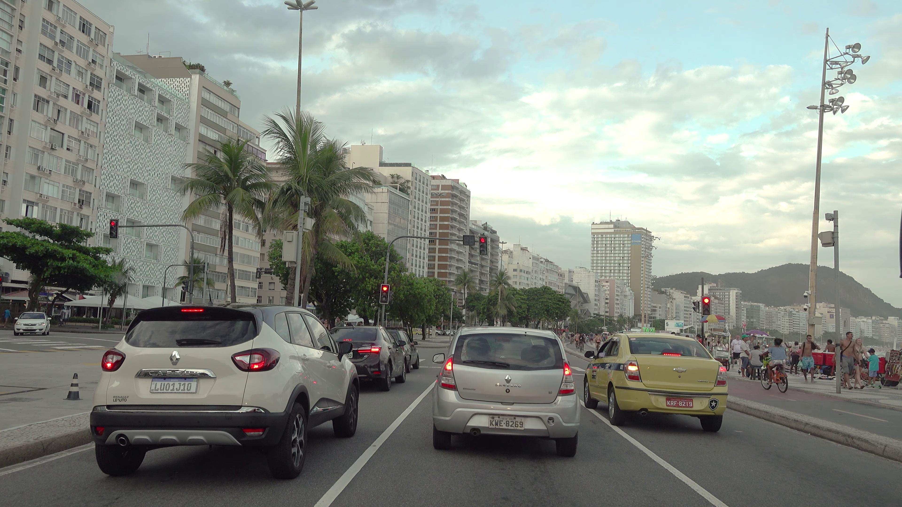

# 🚘 Klasifikasi Plat Nomor dengan YOLOv8 + Streamlit

Proyek ini adalah aplikasi web sederhana menggunakan **Streamlit** yang memungkinkan pengguna untuk mengunggah gambar plat nomor kendaraan dan mengklasifikasikannya menggunakan model **YOLOv8**.

---

## 🖼️ Fitur

- Upload gambar plat nomor (`jpg`, `jpeg`, `png`)
- Deteksi & klasifikasi plat nomor dengan model **YOLOv8**
- Menampilkan hasil deteksi dengan **bounding box**, label, dan tingkat keyakinan
- UI sederhana & interaktif berbasis **Streamlit**

---

## 🧠 Teknologi

- [Streamlit](https://streamlit.io/)
- [Ultralytics YOLOv8](https://docs.ultralytics.com/)
- Python 3.8+

---

## 📦 Instalasi

1. Clone repository ini

```bash
git clone https://github.com/username/klasifikasi-plat-streamlit.git
cd klasifikasi-plat-streamlit
```


2. Install dependencies

```bash
pip install -r requirements.txt
```

Jika belum ada `requirements.txt`, install manual:

```bash
pip install streamlit ultralytics pillow
```

3. Jalankan aplikasi

```bash
streamlit run app.py
```

---

## 🧾 Struktur Folder

```
.
├── app.py              # Aplikasi utama Streamlit
├── best.pt             # Model YOLOv8 hasil training (diletakkan di sini)
├── README.md           # Dokumentasi ini
```

---

## 📸 Contoh Hasil

| Upload                  | Output Deteksi                           |
| ----------------------- | ---------------------------------------- |
|  |  |

> Gambar di atas hanya ilustrasi. Tambahkan folder `photo/` jika ingin menyimpan contoh output.

---

## 📌 Catatan

- Pastikan file model YOLO (`best.pt`) adalah hasil training untuk klasifikasi/deteksi plat nomor.
- Anda bisa mengadaptasi kode untuk melakukan **crop**, **OCR**, atau menyimpan hasil deteksi.

---

## 📬 Kontak

Jika ada pertanyaan, silakan hubungi:

- 📧 Email: [isaiantmaulana2004@example.com](mailto:isaiantmaulana2004@example.com)
- 🧑 GitHub: [@isaaja](https://github.com/isaaja)